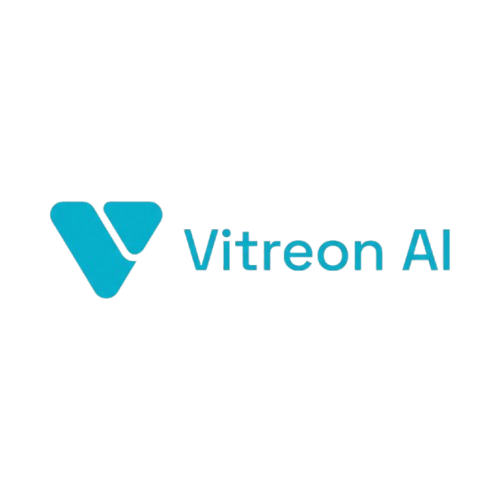

  
   
  <h3><b>The Ultimate AI Orchestration Platform</b></h3>
  
Route tasks intelligently across specialized AI agents in a beautiful, unified workspace.

  
  

    
    
    
    
    
  

---

## 🌟 What is Vitreon?

Vitreon is an advanced, multi-agent AI interface designed to seamlessly route your requests to the most capable AI model for the job. Whether you need deep technical research, high-performance code generation, or creative content writing, Vitreon handles it effortlessly within a stunning, glassmorphism-inspired UI.

### ✨ Key Features
- **🧠 Multi-Agent Architecture:** Instantly switch between specialized agents (Prism, Lucent, Refract, Spectrum) tailored for coding, research, creativity, and data analysis.
- **⚡ Blazing Fast Streaming:** Optimized TTFT (Time-To-First-Token) using state-of-the-art asynchronous database caching and model routing.
- **🎨 Stunning UI/UX:** Built with Framer Motion and Tailwind CSS for fluid micro-animations, glassmorphism aesthetics, and a flawless responsive design.
- **🔌 OpenRouter Integration:** Dynamically pulls the best free models (like Nemotron Lightning and Liquid LFM) to ensure zero-cost, high-speed inferences.
- **💳 Premium Monetization:** Fully integrated with Razorpay for subscription tiering and pro usage capabilities.

## 🚀 Getting Started

To run Vitreon locally, ensure you have Node.js 18+ installed.

### 1. Clone the repository
\`\`\`bash
git clone https://github.com/debabrataswainiitp/VITREON.git
cd VITREON
\`\`\`

### 2. Install Dependencies
\`\`\`bash
npm install
\`\`\`

### 3. Setup Environment Variables
Create a \`.env\` file in the root directory and add the necessary keys for Database (Prisma), Authentication (Clerk), and AI (OpenRouter):
\`\`\`env
DATABASE_URL="your_prisma_connection_string"
NEXT_PUBLIC_CLERK_PUBLISHABLE_KEY="..."
CLERK_SECRET_KEY="..."
OPENROUTER_API_KEY="..."
RAZORPAY_KEY_ID="..."
RAZORPAY_KEY_SECRET="..."
\`\`\`

### 4. Run the Application
\`\`\`bash
npm run dev
\`\`\`
Your application will be live at \`http://localhost:3000\`.

## 🛠 Tech Stack
- **Framework:** Next.js 14 (App Router)
- **Language:** TypeScript
- **Styling:** Tailwind CSS, Framer Motion, GSAP
- **Database:** Prisma ORM (PostgreSQL)
- **Authentication:** Clerk
- **Payments:** Razorpay
- **AI SDK:** Vercel AI SDK (@ai-sdk/react)

## 🤝 Contributing
Contributions, issues, and feature requests are welcome! 
Feel free to check the [Issues page](https://github.com/debabrataswainiitp/VITREON/issues) if you want to contribute.

---

  <b>If you found this project helpful, please drop a ⭐ to show your support!</b>

